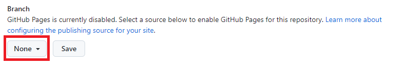

<a href="./README.md">English</a>

    <picture>
        <source media="(prefers-color-scheme: dark)" srcset="./repo/logo-dark.png">
        
    </picture>

    <b>Una página para almacenar gratuitamente tus imágenes, lotties, estilos y scripts para tus proyectos Codepen con el poder de GitHub Pages.</b>

---

    <h2>¿Cómo utilizarlo?</h2>
    
Haga clic en el botón <b>Fork</b> de la parte superior de este repositorio.

    

---

    
Haga clic en el botón <b>Create fork</b>.

    

---

    
En su fork, haga clic en el botón <b>Add file</b> y a continuación en <b>Upload files</b>.

    

---

    
En esta pantalla puede arrastrar las carpetas o archivos que desee utilizar en Codepen y, a continuación, hacer clic en el botón <b>Commit changes</b> para guardar sus archivos en el repositorio.

    

---

    
Ahora haz clic en <b>Settings</b>.

    

---

    
Y ahora haz clic en <b>Pages</b>.

    

---

    
En branch haz click en el botón que dice <b>None</b> y cámbialo a <b>main</b> y haz click en el botón <b>Save</b>.

    

---

    
Si seguiste los pasos correctamente al ir al enlace <b>https://usuario.github.io/codepen-assets/</b> deberías de ver esta página.

    
En la URL cambia <b>usuario</b> por tu nombre de usuario de GitHub

    

---

    
Para usar acceder a los archivo usa <b>https://usuario.github.io/codepen-assets/ruta-del-archivo-en-github.css</b>

---

    <b>Hecho con ❤ por <a href="https://github.com/erikgiovani">Erik Giovani</a></b>

