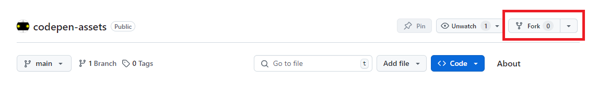
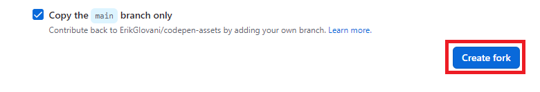
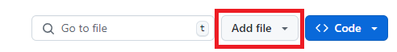
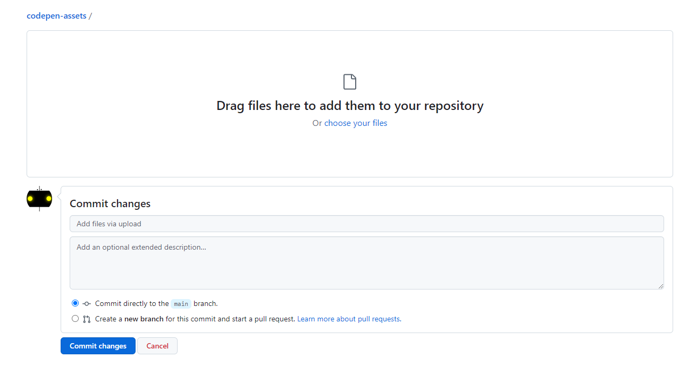
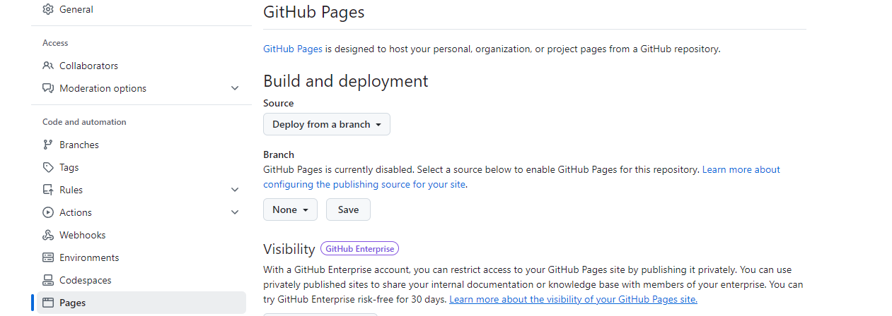

  <a href="ES.md">Español</a>

    <picture>
        <source media="(prefers-color-scheme: dark)" srcset="./repo/logo-dark.png">
        
    </picture>

    <b>A page to store your images, lotties, styles and scripts for free for your Codepen projects with the power of GitHub Pages.</b>

---

    <h2>How to use?</h2>
    
Do click in the <b>Fork</b> button on the top of this repository.

    

---

    
Click on the button that says <b>Create fork</b>.

    

---

    
In your fork, click on the <b>Add file</b> button and then on <b>Upload files</b>.

    

---

    
In this screen you can drag the folders or files you want to use in Codepen and then click on the <b>Commit changes</b> button to save your files in the repository.

    

---

    
Now click on <b>Settings</b>.

    

---

    
And now click on <b>Pages</b>.

    

---

    
Under branch click on the button that says <b>None</b> and change it to <b>main</b> and click on the <b>Save</b> button.

    

---

    
If you followed the steps correctly by going to the link <b>https://user.github.io/codepen-assets/</b> you should see this page.

    
In the URL change <b>user</b> to your GitHub username.

    

---

    
To use file access use <b>https://usuario.github.io/codepen-assets/ruta-del-archivo-en-github.css</b>

---

    <b>Made with ❤ by <a href="https://github.com/erikgiovani">Erik Giovani</a></b>

